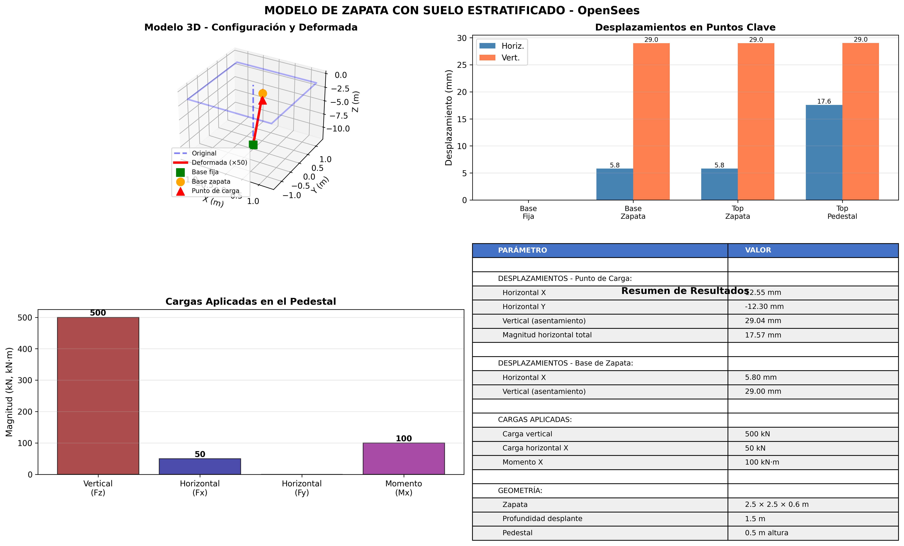

# ZapataU - Modelo de Zapata en OpenSees

Modelo de zapata (footing) con interacción suelo-estructura usando OpenSees.

## Descripción

Este proyecto implementa un modelo tridimensional de una zapata apoyada en suelo estratificado, incluyendo:

- **Zapata**: Elemento de fundación con dimensiones configurables
- **Suelo estratificado**: Múltiples capas de suelo con propiedades diferentes
- **Profundidad de desplante (Df)**: Zapata ubicada a profundidad Df bajo la superficie
- **Pedestal**: Columna que sobresale 0.5 m sobre la zapata
- **Lleno**: Material de relleno sobre la zapata hasta la superficie

## Características del Modelo

- Modelado 3D con elementos finitos
- Suelo modelado con elementos sólidos y resortes no lineales
- Materiales no lineales (J2 Plasticity) para comportamiento elastoplástico del suelo
- Interacción suelo-estructura con conectividad correcta
- Análisis estático no lineal incremental
- Configuración paramétrica mediante archivo JSON
- Tres versiones disponibles: modelo simplificado, modelo 3D lineal, y **modelo 3D no lineal**

## Ejemplo de Resultados



*Ejemplo de análisis con carga vertical de 500 kN mostrando asentamiento de 29 mm*

## Requisitos

- Python 3.7+
- OpenSeesPy
- NumPy
- Matplotlib

## Instalación

```bash
pip install -r requirements.txt
```

## Uso

### Modelo Simplificado (Para diseño preliminar)

El modelo simplificado usa resortes equivalentes para representar el suelo estratificado. Es rápido y robusto.

```bash
# Ejecutar modelo simplificado
python opensees_zapata_simple.py

# Generar visualizaciones
python visualizar_simple.py
```

**Resultado típico:** Asentamiento ~ 29 mm (sin confinamiento lateral)

### Modelo 3D No Lineal (Recomendado para diseño detallado) ⭐

Modelo con materiales no lineales (J2 Plasticity) y conectividad correcta entre componentes.

```bash
# Ejecutar modelo 3D no lineal
python opensees_zapata_3d_nolineal.py
```

**Características:**
- ✅ Materiales elastoplásticos para suelo
- ✅ Conectividad correcta (nodos compartidos)
- ✅ Análisis no lineal incremental
- ✅ Confinamiento lateral

**Resultado típico:** Asentamiento ~ 4.6 mm (con confinamiento 3D)

### Modelo 3D Lineal (Versión antigua - en desarrollo)

Modelo con elementos sólidos brick y materiales elásticos.

```bash
# Ejecutar modelo 3D lineal (puede tener problemas de convergencia)
python opensees_zapata_model.py
```

### Ejecución con configuración personalizada

```bash
python opensees_zapata_3d_nolineal.py --config mi_configuracion.json
```

## Estructura del Proyecto

```
ZapataU/
├── README.md                        # Este archivo
├── requirements.txt                 # Dependencias de Python
├── config_zapata.json              # Configuración del modelo
│
├── opensees_zapata_3d_nolineal.py  # ⭐ Modelo 3D no lineal (RECOMENDADO)
├── opensees_zapata_simple.py       # Modelo simplificado con resortes
├── opensees_zapata_model.py        # Modelo 3D lineal (en desarrollo)
│
├── visualizar_simple.py            # Visualización modelo simplificado
├── visualizar_resultados.py        # Visualización modelo 3D
├── verificar_rigideces.py          # Verificación de cálculos
│
├── MODELO_3D_NOLINEAL.md           # Documentación modelo 3D
├── MEMORIA_CALCULO_RIGIDECES.md    # Memoria de cálculo
│
├── ejemplo_ejecucion.sh            # Script de ejemplo
├── ejemplos/                       # Ejemplos de resultados
│   └── resultados/
│       ├── graficas_modelo_zapata.png
│       └── ejemplo_resultados.txt
└── resultados/                     # Carpeta para resultados (auto-generada)
```

## Configuración del Modelo

Edita `config_zapata.json` para modificar:

- Dimensiones de la zapata
- Propiedades de capas de suelo
- Profundidad de desplante
- Cargas aplicadas
- Parámetros de análisis

## Resultados

El modelo genera:

- Desplazamientos nodales
- Reacciones en la base
- Distribución de presiones
- Gráficos de deformada
- Archivos de salida para post-procesamiento

## Autor

Desarrollado con Claude AI para análisis de fundaciones.

## Licencia

MIT License
